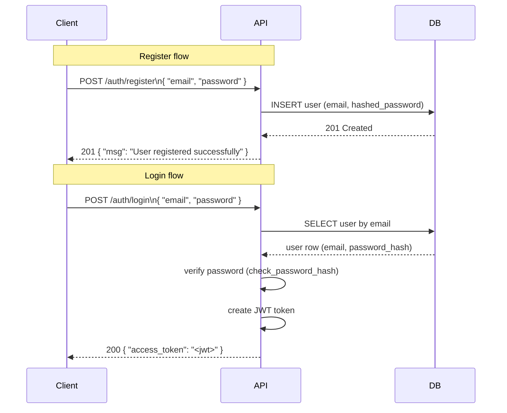
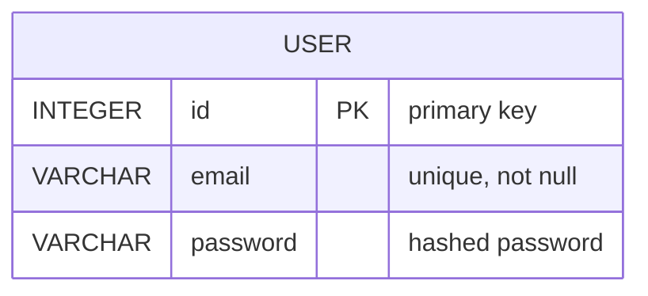

# Project Diagrams

## Sequence Diagram (register / login)

```mermaid
sequenceDiagram
    participant Client
    participant API
    participant DB

    Note over Client,API: Register flow
    Client->>API: POST /auth/register\n{ "email", "password" }
    API->>DB: INSERT user (email, hashed_password)
    DB-->>API: 201 Created
    API-->>Client: 201 { "msg": "User registered successfully" }

    Note over Client,API: Login flow
    Client->>API: POST /auth/login\n{ "email", "password" }
    API->>DB: SELECT user by email
    DB-->>API: user row (email, password_hash)
    API->>API: verify password (check_password_hash)
    API->>API: create JWT token
    API-->>Client: 200 { "access_token": "<jwt>" }
```

## ER Diagram

```mermaid
erDiagram
    USER {
        INTEGER id PK "primary key"
        VARCHAR email "unique, not null"
        VARCHAR password "hashed password"
    }
```

Notes

- Diagrams are in mermaid format; renderable in Markdown viewers that support mermaid.
